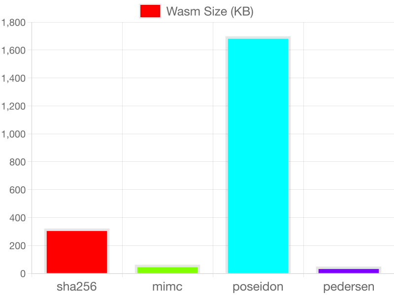
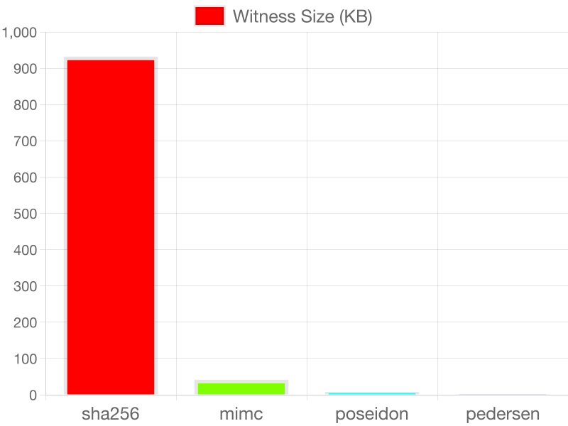
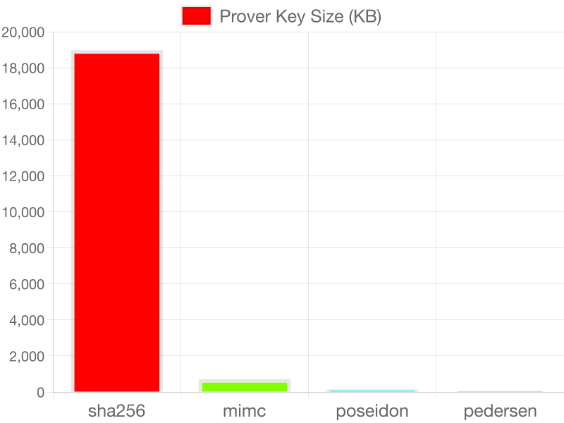
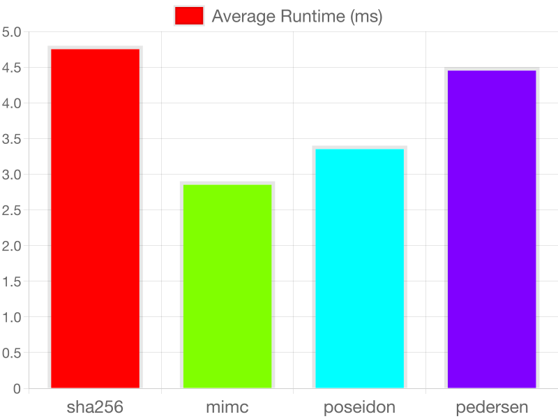

# Prover Side Performance Test of Groth16 of Hash Functions

This is a performance test of the prover side of the Groth16 proof system for hash functions. The test will be conducted on the following hash functions:

- SHA256
- MiMC
- Poseidon
- Pedersen

Groth16 has constant proof size and verification time. But the prover side has a variable time and space complexity depending on the circuit complexity. So, we will analyze the prover side performance of the Groth16 proof system for the above hash functions on the following parameters:

- WASM File Size
- R1CS File Size
- Witness File Size
- Prover Key Size
- Prover Time

## Results

### WASM File Sizes

<p align="center" style="background-color:white;">  </p>

### R1CS File Sizes

<p align="center" style="background-color:white;">  </p>

### Witness File Sizes

<p align="center" style="background-color:white;">  </p>

### Prover Key Sizes

<p align="center" style="background-color:white;">  </p>

### Prover Runtimes

<p align="center" style="background-color:white;">  </p>

## Requirements

- Circom: 2.1.8
- NodeJS: 20.10.0
- SnarkJS: 0.7.3

## Install Dependencies

```bash
npm install
```

## Trusted Setup Ceremony (powersoftau)

### Start the Ceremony

```bash
mkdir ZKSetup && snarkjs powersoftau new bn128 16 ZKSetup/pot16_0000.ptau -v
```

### Contribution to the Ceremony

First contribution

```bash
snarkjs powersoftau contribute ZKSetup/pot16_0000.ptau ZKSetup/pot16_0001.ptau --name="First contribution" -v
```

Final contribution

```bash
snarkjs powersoftau prepare phase2 ZKSetup/pot16_0001.ptau ZKSetup/pot16_final.ptau -v
```

### Verify the Ceremony

```bash
snarkjs powersoftau verify ZKSetup/pot16_final.ptau
```

## Generate WASM files

```bash
circom circuits/sha256.circom --wasm
```

```bash
circom circuits/mimc.circom --wasm
```

```bash
circom circuits/poseidon.circom --wasm
```

```bash
circom circuits/pedersen.circom --wasm
```

## Generate R1CS files

```bash
circom circuits/sha256.circom --r1cs -o sha256_js
```

```bash
circom circuits/mimc.circom --r1cs -o mimc_js
```

```bash
circom circuits/poseidon.circom --r1cs -o poseidon_js
```

```bash
circom circuits/pedersen.circom --r1cs -o pedersen_js
```

## Generate witness files

```bash
node sha256_js/generate_witness.js sha256_js/sha256.wasm input.json sha256_js/witness.wtns
```

```bash
node mimc_js/generate_witness.js mimc_js/mimc.wasm input.json mimc_js/witness.wtns
```

```bash
node poseidon_js/generate_witness.js poseidon_js/poseidon.wasm input.json poseidon_js/witness.wtns
```

```bash
node pedersen_js/generate_witness.js pedersen_js/pedersen.wasm input.json pedersen_js/witness.wtns
```

## Generate Prover Keys

```bash
snarkjs groth16 setup sha256_js/sha256.r1cs ZKSetup/pot16_final.ptau sha256_js/prover_key.zkey
```

```bash
snarkjs groth16 setup mimc_js/mimc.r1cs ZKSetup/pot16_final.ptau mimc_js/prover_key.zkey
```

```bash
snarkjs groth16 setup poseidon_js/poseidon.r1cs ZKSetup/pot16_final.ptau poseidon_js/prover_key.zkey
```

```bash
snarkjs groth16 setup pedersen_js/pedersen.r1cs ZKSetup/pot16_final.ptau pedersen_js/prover_key.zkey
```

## Generate Verification Keys

```bash
snarkjs zkey export verificationkey sha256_js/prover_key.zkey sha256_js/verification_key.json
```

```bash
snarkjs zkey export verificationkey mimc_js/prover_key.zkey mimc_js/verification_key.json
```

```bash
snarkjs zkey export verificationkey poseidon_js/prover_key.zkey poseidon_js/verification_key.json
```

```bash
snarkjs zkey export verificationkey pedersen_js/prover_key.zkey pedersen_js/verification_key.json
```

## Generate Proofs

```bash
snarkjs groth16 prove sha256_js/prover_key.zkey sha256_js/witness.wtns sha256_js/proof.json sha256_js/public.json
```

```bash
snarkjs groth16 prove mimc_js/prover_key.zkey mimc_js/witness.wtns mimc_js/proof.json mimc_js/public.json
```

```bash
snarkjs groth16 prove poseidon_js/prover_key.zkey poseidon_js/witness.wtns poseidon_js/proof.json poseidon_js/public.json
```

```bash
snarkjs groth16 prove pedersen_js/prover_key.zkey pedersen_js/witness.wtns pedersen_js/proof.json pedersen_js/public.json
```

## Verify Proofs

```bash
snarkjs groth16 verify sha256_js/verification_key.json sha256_js/public.json sha256_js/proof.json
```

```bash
snarkjs groth16 verify mimc_js/verification_key.json mimc_js/public.json mimc_js/proof.json
```

```bash
snarkjs groth16 verify poseidon_js/verification_key.json poseidon_js/public.json poseidon_js/proof.json
```

```bash
snarkjs groth16 verify pedersen_js/verification_key.json pedersen_js/public.json pedersen_js/proof.json
```

## Analysis

**Command**: `node analysis.js [hash_function] [number_of_iterations]`

```bash
node analysis.js sha256 10
```

```bash
node analysis.js mimc 10
```

```bash
node analysis.js poseidon 10
```

```bash
node analysis.js pedersen 10
```

## Plot Analyzed Data

```bash
node visualizor.js
```
